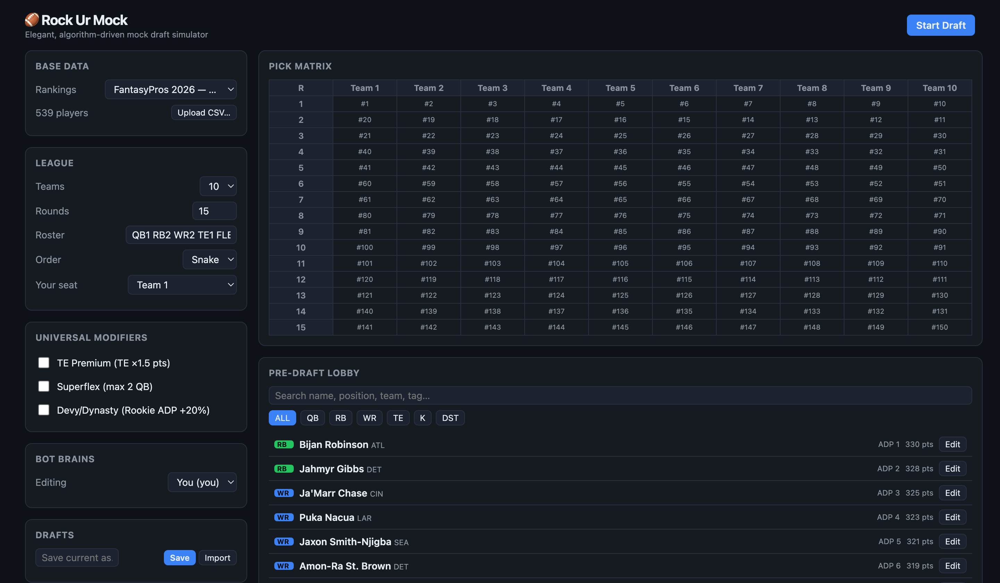

# Rock Ur Mock
***Built by a fantasy football junkie for fantasy football junkies***

Rock Ur Mock is a browser-based fantasy football mock draft simulator. Set up a league, tune a
roster of bot opponents, and draft — every bot pick shows the math behind it.



## Why I built this

I have a competitive keeper league with my college buddies and kept running into what if scenarios during the offseason that free tools wouldn't support. These what-ifs include:
- I'm not sure exactly which keepers my league mates will choose. So I would like to set probabilities to different players being kept.
- I'm not sure which draft slot my league mates will choose, so I would like to be able to easily copy over keepers between different slots
- I'm not sure which draft strategy my league mates will choose, so I would like to be able to simulate different draft strategies
- I'm not sure which draft slot I should pick, so I would like to run a bunch of mocks from slot A and a bunch in slot B, and then track stats across how good my board looks across each slot.

## What it is

A small, self-contained tool for rehearsing a fantasy draft against opponents you
configure. You set the league (teams, rounds, roster, scoring), give each bot a
personality, and either draft your own team or watch the whole thing simulate. It
runs entirely in the browser — no account, no server.

## What sets it apart

Plenty of mock draft tools exist; these are the pieces this one leans into:

- **Bring your own rankings.** It ships with a default set, but you can swap
  ranking sources or upload any FantasyPros-style CSV — columns are matched by
  alias, so most exports drop in without code changes.
- **Keepers with probability.** A keeper needn't be locked in: give it a percent
  chance, let two players compete for the same pick ("keep A or B"), or set a
  per-team cap — each simulation rolls a fresh, valid keeper set.
- **Swap draft slots.** Nudge any team left or right before the draft to trade
  draft position; its keepers and seat come along.
- **Transparent bot picks.** Hover any pick to see the exact score breakdown —
  value, ADP, roster need, age, and the chaos roll — that produced it.
- **Bots you control.** Each bot is four sliders (ADP bias, chaos, roster need,
  age upside), so you can shape a value-hunter, a reacher, or a wildcard.
- **Compare across mocks.** Save any number of drafts, then check two or more to
  open a Mock Stats rail — starter floor/ceiling, best- and worst-case boards, and
  how often each player lands on your team — so you can settle "slot A or slot B?"

## Installation

```bash
npm install
npm run dev       # http://localhost:5173
```

Then open http://localhost:5173 in your browser and you're ready to draft.

## Quickstart

Launch the app and click "Tour" OR watch the walkthrough below:

<video src="https://github.com/rishigurnani/rock-ur-mock/raw/main/docs/tour-demo.mp4" controls muted width="800">
  <a href="https://github.com/rishigurnani/rock-ur-mock/raw/main/docs/tour-demo.mp4">Watch the guided tour walkthrough</a>
</video>

## Features

| Feature | What it does |
|---------|--------------|
| Pick Matrix | Snake/linear order, traded picks, keepers (with keep-A-or-B odds), and the pick on the clock, all on one board |
| Probabilistic keepers | Percent-chance keepers, "keep A or B" candidates, and a per-team cap |
| Slot swapping | Move a team's draft position before the draft |
| Custom rankings | Swap ranking sources or upload your own CSV |
| Slider bots | Four sliders per bot shape every draft personality |
| Universal modifiers | One-click rules like TE Premium, Superflex, or a rookie ADP boost |
| God-Mode traces | The full scoring math behind every bot pick, on hover |
| What-if injuries | Zero a player's projection to simulate them being out |
| Bye-week management | Flags weeks where too many of your starters sit out |
| Mock Stats | Compare 2+ saved drafts — starter floor/ceiling, best/worst outcome, and each player's draft rate |
| Save / backup drafts | Name and store mocks, export any or all to JSON, and import them back |

## Where your drafts are saved

Saved drafts live in your **browser's localStorage** under the key
`rockurmock.sessions`. They stick around across page refreshes as long as you use
the same browser on the same machine. Clearing your browser's site data removes
them — so to keep a draft safe or move it to another machine, use **Backup all**
(or a single draft's ⤓) to export JSON, and **Import** to restore it.

There's no server or database yet: `db/schema.sql` sketches the PostgreSQL schema
for a future backend, but nothing is wired up to it. Everything runs client-side.

## Resources

- **Code layout**

  | Area | Files |
  |------|-------|
  | Draft orchestration | `src/engine/draft.ts` |
  | Pick Matrix | `src/engine/matrix.ts` |
  | Modifier rules | `src/engine/modifiers.ts` |
  | Bot scoring | `src/engine/bot.ts`, `src/engine/vbd.ts`, `src/engine/roster.ts` |
  | Player data / CSV parsing | `src/data/datasets.ts`, `src/data/parseRankings.ts` |
  | Cross-mock stats | `src/engine/mockStats.ts`, `src/store/compare.ts` |
  | State + session save/restore | `src/store/draftStore.ts`, `src/store/sessions.ts` |

- **Testing** — `npm test` runs the engine test suite. `npm run build`
  typechecks and produces a production build.
- **Engine design** — `src/engine/*` has no React imports and routes all
  randomness through an injectable RNG, so drafts are reproducible and easy to
  unit test.
